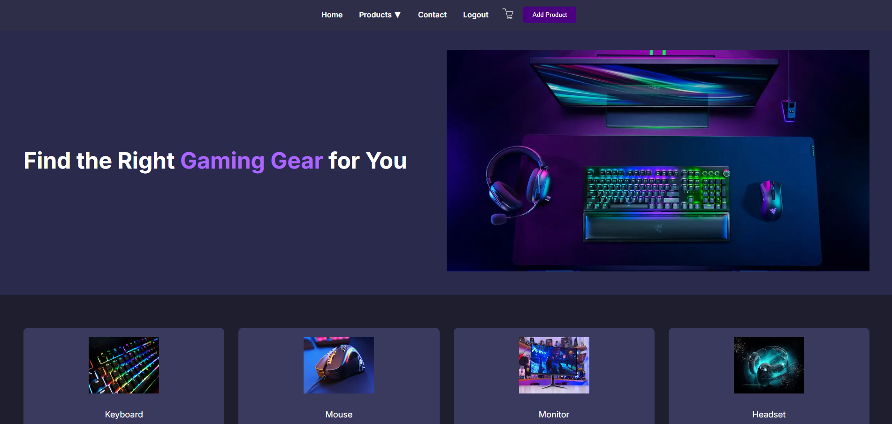
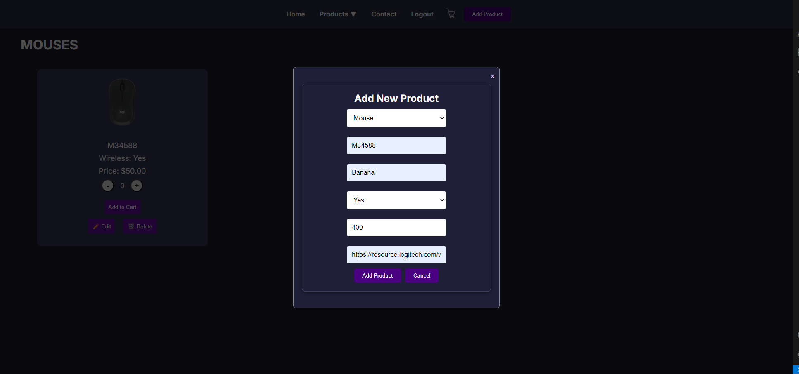
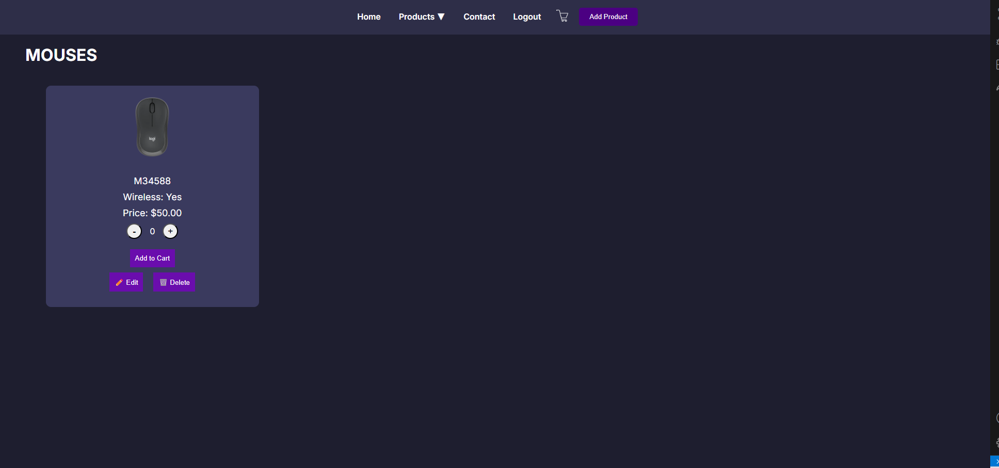
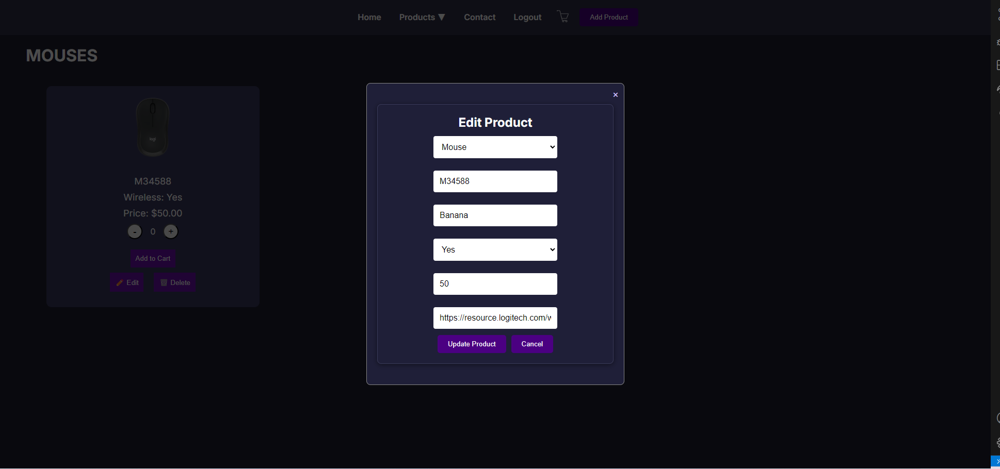
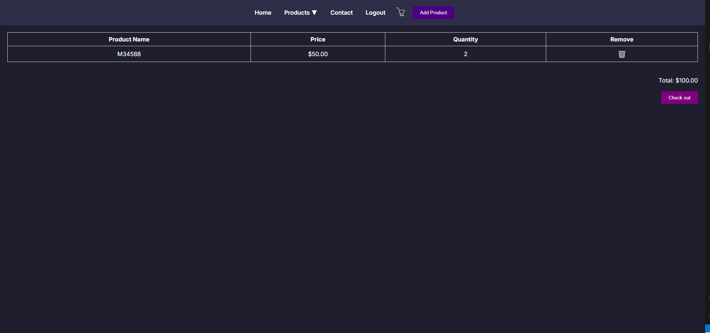
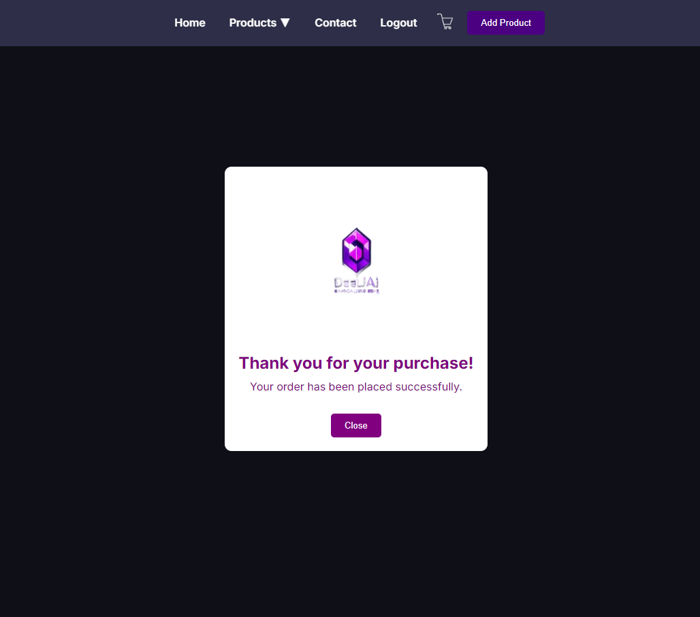
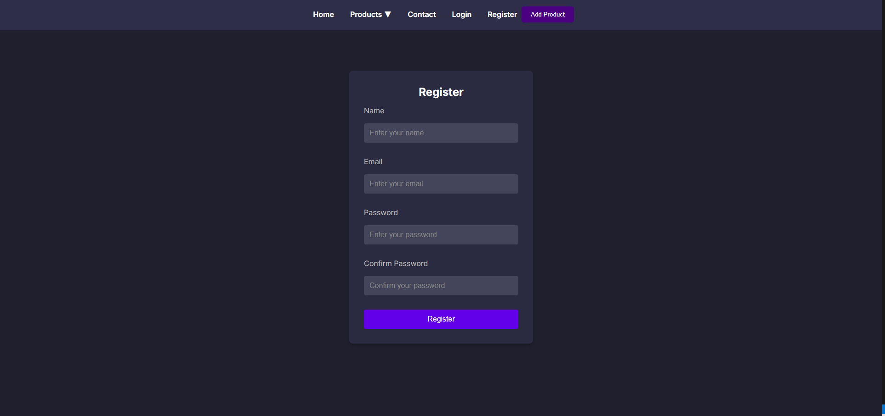
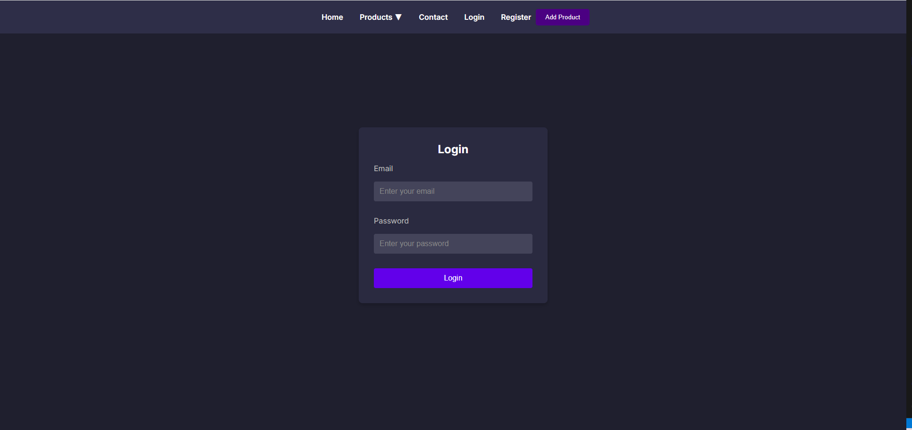

# Deejai Gaming Gear

## Team Members
- [Phutthiphat Tatiyawongsoonthorn](https://github.com/alicejohnson)
- [Pachara Chotiyanont](https://github.com/bobsmith)
- [Jitrada Tepsuttinun](https://github.com/charliebrown)

## Project Description
This project is the web application about gaming gear store allow users to view and add gaming gear products to their carts.

Frontend UI and Backend API developed using Next.js framework. Database for persistent application data using MongoDB.

### Features
- User Accounts - Secure user registration and login.
- Product Catalog - Display of gaming gear with filtering options by category. Adding new products to the catalog.
- Cart System - Persistent shopping cart that saves items across sessions and calculate total product.

## Screenshots
### Home

### Add Product

### Product Catalog

### Update Product

### Cart

### Checkout

### Register

### Login
